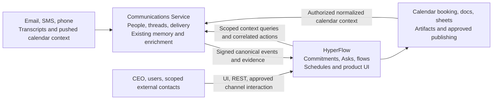
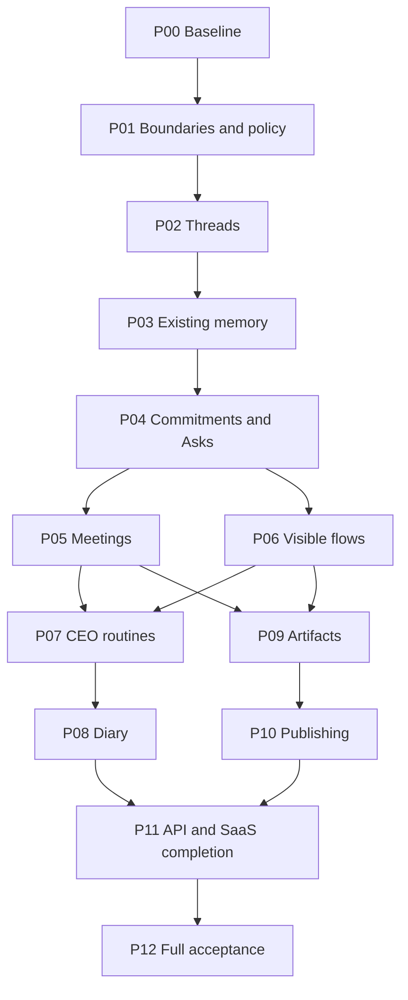

# HyperFlow implementation plan: two applications, clear ownership

Prepared: 8 September 2026. Audience: Codex implementing for the CEO as the first customer.

**Scope correction:** this plan uses the memory, enrichment and search already in Communications Service. There is no memory extraction, third memory application, new LLM wiki service or knowledge-store migration. This decision supersedes the separate-memory direction in the product paper for this implementation programme.

This document defines planned work, not a release claim. Phase execution and evidence are tracked in `IMPLEMENTATION_STATUS.md`; Phase 00 has since established the baseline without application source or deployment changes.

## 1. Target outcome

Turn the CEO's communications into visible, repeatable work: identify the right person and thread, recover relevant context, establish what is owed and when, execute permitted actions, and verify the outcome through HyperFlow Asks.

The integrated product supports triage, receptionist work, SMS/phone follow-up, meeting action capture, diary coordination, reporting, branded artifacts and eventually approved publishing. It remains two distinct applications:

- **Communications Service:** people, channel identities, provider connections for communications, canonical communications and threads, delivery/transcript records, existing communication memory and enrichment.
- **HyperFlow:** business intent, project access, delegation, operational commitments, Asks, workflow execution, schedules, deliverables, business-system actions and the human-readable UI.

The user can request work naturally, then inspect the steps, dependencies, evidence, approvals and exceptions in HyperFlow. A generated plan becomes an executable flow only after schema and policy validation.

Initial authority: email is draft-only through every entry point. SMS and phone are permitted within configured recipient/purpose limits. Calendar changes and public publication start as proposals requiring approval until a specific policy is granted. Channel authority does not imply authority to make material commercial commitments.

## 2. Current repository baseline

Snapshot from local inspection; refresh at Phase 00 because these repositories may change between planning and execution.

| Repository | Observed revision/state | What the snapshot establishes |
|---|---|---|
| `hyperflow-5` | HEAD `6b9acf5`; tracked changes and untracked Thread Register work present. | Existing engine, Asks, triage, coaching, schedules and tenant UI. Local Thread Register integration is not yet a verified cross-service contract. |
| `communications-service` | HEAD `7ba163a`; no changes reported by `git status --short`. | Source includes Gmail and Outlook adapters, calendar ingestion, memory, facts/commitments, recordings, signed events and scheduler helper. This does not establish deployed readiness. |
| `Documents/ChatGPT/communications-service` | HEAD `8c8b9d2` (`Add person-aware communication threading`); extensive tracked changes plus untracked `019_ranked_thread_resolution.sql`, `docs/THREADING.md` and database tests. | A second checkout of Communications contains Thread Register, candidate and rethread routes; migrations `018` and pending `019` exist here. It must be reconciled with the other checkout before deciding what remains to implement. |

The two Communications paths are checkouts of the same application, not separate services. Phase 00 must compare their history and local edits, identify the intended delivery checkout, and preserve unpublished work. Do not reset either checkout, merge blindly, or rebuild the ranked resolver just because it is absent from the first path.

### Verified starting points and gaps

| Area | Evidence inspected | Consequence for implementation |
|---|---|---|
| HyperFlow workflow/Ask foundation | `lib/humanAsk.ts`, `lib/asks/`, `lib/serverFlow.ts`, `lib/serverExecutor.ts`, tests and API reference. | Extend current semantics; do not create a second approval engine. |
| Triage and cadence | `lib/triage/runEmailTriage.ts`, `lib/scheduler.ts`, service setup and existing tests. | Retain cursor/lease/retry behavior while adding new projections and routines. |
| Local Thread Register | `components/ThreadRegister.tsx`, `lib/communications/threadRegister.ts`, client methods and tests. | Calls register, thread-candidates and rethread endpoints absent in the first Communications checkout but present in the `Documents/ChatGPT` checkout. Reconcile versions and validate existing work before presenting the feature as complete. |
| Canonical communications | Communications `communicationModel.js`, `v1.js`, `eventOutbox.js`, `tenantContext.js`, provider adapters. | Keep canonical IDs and thread resolution in Communications. |
| Existing memory | Communications `memory.js`, `enrichment.js`, migration `005`, and `/context/search`, person/project memory, thread and loose-end routes. | Use these APIs and improve bounded gaps in place. No new memory platform. |
| Existing extracted commitments | `communication_commitments` and `/commitments/:commitmentId/status`. | Inventory current consumers and writes before adding HyperFlow's accepted operational ledger. Do not treat every extracted row as an accepted obligation. |
| Calendar and meetings | `calendar.js`, `calendarProviders.js`, `recordings.js`, `transcripts.js`, `plaud.js`, existing memory views. | Reuse normalized calendar context and transcript models. A pushed event adapter is not evidence of working calendar booking. |
| Connected mailboxes | `gmailMailbox.js`, `outlookMailbox.js`, `mailboxService.js`, migrations through `017`. | Current source is ahead of older HyperFlow documentation that described Outlook as unavailable. Verify each supported provider and update docs. |
| Scheduling helper | Communications `hyperflowScheduler.js` calls HyperFlow's tick endpoint. | It is an operational trigger, not ownership of HyperFlow's business schedules. Retain initially and document the dependency. |
| Email policy | HyperFlow `/api/send-email` and Communications `/v1/emails` exist alongside draft-only connected mailbox routes. | Enforce the CEO policy at both application and transport boundaries; do not rely only on hidden UI controls. |
| Dependency drift | Communications manifest uses `svix: ^2.1.0`; lockfile points to `2.1.0`. | Verify the current verifier contract and reproducible install behavior; resolve manifest/lock drift as a baseline issue if needed. Do not assume prior pinning still holds. |

No test results or live deployment observations are claimed from this planning pass. The first goal must capture fresh evidence.

## 3. Ownership contract

### Authoritative owners

| Concern | Communications Service owns | HyperFlow owns |
|---|---|---|
| People | Canonical contact ID, identities, addresses/numbers, communication preferences and source-attributed contact enrichment. | Tenant user membership, project grants, workflow roles and mappings to canonical contact IDs. |
| Threads | Canonical cross-channel thread ID, communication membership, resolution/correction and audit. | References to those IDs; project/task/Ask associations and UI composition. No independent thread resolver or thread database. |
| Channel operations | SMS/voice/email provider adapters, mailbox OAuth/sync/drafts, provider receipts, recordings/transcripts and delivery retries. | Decides why/when/who to contact under delegation; creates correlated action runs and interprets business consequences. |
| Memory | Existing facts, extracted promise evidence, summaries, context search, loose ends, enrichment workers and memory eligibility. | Uses permitted results as context; does not create another memory store or enrichment worker. |
| Operational commitments | Preserves what was said and extracted, with source evidence. | Accepted owner, beneficiary, scope, due date, changes, dependency, submission, acceptance and fulfillment. |
| Asks | Channel binding, delivery, reply correlation and transport-side resolution acknowledgement. | Ask meaning, authorization, response interpretation, accepted decision and effect on the correct run. |
| Meetings | Canonical transcript/communication ingestion, speaker/contact links, calendar context and derived communication memory. | Review and execution of meeting actions; follow-up and deliverable flows. |
| Calendar | Existing normalized event context and participant links for communications/memory. | Diary policy, availability decisions, booking proposals and authorized provider mutations through business integration adapters. Provider remains authoritative for the actual event. |
| Artifacts and publishing | Communicates about an artifact; holds source communication/attachment references. | Templates, brand assets, artifact versions, rendering/validation, document/sheet/CMS/social actions and publication receipts. |
| Cadence | Its ingestion/delivery/enrichment worker schedules; existing HyperFlow tick helper. | Business schedules, occurrence ownership, follow-up timing and workflow retries. |
| UI/API | Standalone Communications API and operational diagnostics. | HyperFlow product UI and its business API, composing authorized Communications reads/actions. |

### Hard boundaries

1. No application reads or writes the other application's database. Cross-service operations use versioned APIs/events.
2. Shared IDs are references, not a licence to duplicate authoritative state. Projections declare owner, source version and freshness.
3. Communications can operate independently of HyperFlow for supported communications functions. HyperFlow-specific projects remain opaque external references there.
4. Communications' extracted commitments remain evidence. HyperFlow alone owns whether an operational promise has been accepted or fulfilled.
5. No provider webhook directly mutates a HyperFlow business commitment without its authenticated event handler, idempotency and domain transition checks.
6. HyperFlow does not duplicate mailbox/calendar-context ingestion or implement its own SMS/phone client. Communications does not gain report workflows, review gates, artifact generation or publication policy.
7. Draft-only email is a tenant/client policy enforced on every route that could dispatch, including Ask delivery, fallback agents and digests. Do not disable unrelated customers' authorized email capabilities globally.
8. Existing memory APIs must respect effective person/project/source visibility, not just tenant membership. If a context request cannot be safely scoped, deny it or return restricted results.

### Integration shape

For document-based reporting, HyperFlow reads allowed business resources as action inputs. This plan does not ingest arbitrary documents into a new wiki or expand Communications into a universal document store. Broader knowledge ingestion is a later separately scoped decision.

## 4. Phase structure and Codex execution rules

Implement one phase goal at a time. Large phases contain ordered work packages that can be separate goals; each goal must name its acceptance gate. Do not create one unbounded goal covering the entire programme.

For each phase:

1. Refresh repository status and read current instructions. Preserve unrelated changes.
2. Record baseline, scope, contracts and test strategy before editing.
3. Implement the named work package(s) in the owning repository first, then update consumers.
4. Run appropriate deterministic, integration and UI checks. Use controlled provider acceptance only under the session's existing authority and configured targets; reconcile uncertain billable outcomes before retry.
5. Update the phase record and each changed app's own API/operations docs. Record commits, migrations, deployment evidence, risks and rollback procedure.
6. Mark completion only when every mandatory gate passes. Distinguish implemented, locally tested, deployed and live-accepted states.

Use [CODEX_PHASE_GOAL_TEMPLATE.md](CODEX_PHASE_GOAL_TEMPLATE.md) as the repeatable instruction and evidence format. Track programme progress in [IMPLEMENTATION_STATUS.md](IMPLEMENTATION_STATUS.md). Do not set a token budget unless the user explicitly requests one. Do not launch later phases automatically merely because an earlier goal finishes.

The master plan and programme ledger live in HyperFlow's `docs/`. Phase records belong in each changed repository's `docs/implementation/Pxx.md`, with cross-links. This is project documentation, not Codex's personal memory folder.

## 5. Phase 00 — Establish a trustworthy baseline

**Dependencies:** none. **Lead:** both repositories, each for its own code. **Result:** a reconciled starting point and known blockers.

**Work packages**

- P00.1: inventory active branches, local modifications, current deployments, schema versions, configured provider capabilities and known failures. Compare both Communications checkouts, including committed migration 018 and pending migration 019 in the `Documents/ChatGPT` checkout; identify the intended source/delivery checkout and which pending Thread Register edits are intended to ship. Never sweep unrelated changes into a baseline commit.
- P00.2: run existing safe suites, type/build checks and contract checks. Separate infrastructure failures from regressions. Inspect full-suite provider behavior before execution.
- P00.3: reconcile docs with source for Outlook, scheduler triggering, thread endpoints, email authority and dependency versions. Record missing contracts as work for Phase 02 rather than claiming the UI fixture proves the backend.
- P00.4: establish a controlled CEO acceptance tenant, contacts, mailbox and phone/SMS targets, and a second tenant for isolation. Record non-secret fixture identifiers and the actual authority/budget for live runs.

**Acceptance:** both app baselines and both Communications checkouts are documented with revisions and dirty state; an intended implementation checkout is established without losing edits; safe check results are reproducible; deployment readiness is explicitly verified or marked unavailable; mismatch list distinguishes existing unpublished Thread Register work from missing functionality; no live-result claims are inferred from source.

**Documentation:** each app's `docs/implementation/P00.md`, updated readiness notes, root programme ledger. No feature expansion in this phase.

**Codex goal:** “Establish and document the current HyperFlow and Communications Service baseline for this programme. Reconcile source, contracts, local changes and deployment evidence; run safe existing checks; identify blockers without introducing new product features. Complete the Phase 00 acceptance gate.”

## 6. Phase 01 — Lock down ownership, authority and contracts

**Dependencies:** P00. **Lead:** both. **Result:** explicit interfaces and enforceable CEO policy before further automation.

**Work packages**

- P01.1: record architecture decisions for the ownership matrix, canonical IDs, scoped authorization, extracted versus operational commitments, and calendar boundaries. Version shared event fixtures with a designated owner and compatibility policy.
- P01.2: expose per-organization email authority (draft-only by default, including the CEO organization) and enforce it in HyperFlow actions, Asks, agent replies and digest delivery; enforce a corresponding tenant/client permission at Communications send endpoints. Permitted SMS/voice actions retain complete correlation and recipient/purpose limits.
- P01.3: define a server-enforced delegation model and scoped service authentication. Preserve tenant isolation and add project/private-source scope where required for context. Prohibit body-supplied privilege escalation.
- P01.4: publish/update API schemas for touched surfaces, idempotency semantics, async operations and errors. Preserve existing clients using additive contracts first.

**Acceptance:** direct API attempts cannot bypass draft-only policy; another tenant's separately authorized capability is unaffected; unauthorized scopes are rejected; shared fixtures pass in both applications; declared service ownership is reflected in code paths.

**Documentation:** `docs/architecture/BOUNDARIES.md` in both repos with consistent decisions, own-app API and policy docs, P01 records. These are planned files, not existing artifacts.

**Codex goal:** “Implement the two-app ownership and authority contracts in Phase 01. Keep memory in Communications Service, enforce CEO draft-only email through every path, retain authorized SMS/voice, and verify tenant/project scope and shared contracts. Complete only this phase.”

## 7. Phase 02 — Complete the canonical threading contract

**Dependencies:** P01. **Lead:** Communications; HyperFlow consumes/displays. **Result:** a verified thread register and durable correction behavior across channels.

**Work packages**

- P02.1: reconcile the HyperFlow client's expected register, candidate, correction and update APIs with Communications. Inspect relevant branches/history read-only before implementing a missing endpoint; avoid duplicating existing unpublished work. Assign the canonical contract to Communications.
- P02.2: implement or reconcile resolution with explicit thread/Ask binding precedence. Unscoped ambiguity must clarify or hold. Keep source-native email IDs separate from semantic thread IDs. Preserve evidence, reason and verified actor for manual correction.
- P02.3: complete HyperFlow register integration: filtering, pagination, older communications, edits, candidate display and correction validation. The UI calls owner APIs and stores no alternate canonical thread membership.
- P02.4: execute the existing email → SMS → call journey with simultaneous unrelated matters and stale/duplicate callbacks. Prove corrections persist after reprocessing without replaying completed work.

**Acceptance:** one intended case remains coherent across three channels; distinct cases remain separate; incorrect moves cannot cross tenant/project boundaries; more than 100 threads and 20 communications paginate correctly; correction audit survives refresh; terminal events never approve an Ask merely because they share a thread.

**Documentation:** Communications API/thread resolution rules, HyperFlow Thread Register behavior, shared fixtures, P02 evidence. Capture the fallback strategy for older servers.

**Codex goal:** “Complete Phase 02 canonical threading end to end. Communications owns resolution, membership and corrections; HyperFlow provides the authenticated register UI. Reconcile missing contracts, prove cross-channel continuity and ambiguity safety, and document real acceptance evidence.”

## 8. Phase 03 — Make existing memory usable safely

**Dependencies:** P02. **Lead:** Communications; HyperFlow consumes. **Result:** dependable current memory views without extraction or a new memory architecture.

**Work packages**

- P03.1: inventory current memory routes, enrichment triggers, worker leases, facts, extracted commitments and legacy `context.js` consumers. Resolve misleading channel coverage and distinguish canonical search from older history helpers.
- P03.2: verify scoped search and thread expansion, source citations, freshness, failed-call exclusion, correction propagation and person/project context. Only make bounded fixes needed to support agreed use cases.
- P03.3: preserve original promise wording and uncertainty around inferred dates. Do not promote fallback assumptions such as an inferred weekday/time into a confirmed business deadline.
- P03.4: add/verify HyperFlow client methods for permitted person, thread, project, meeting context and loose ends. Present those results as contextual evidence, with missing/stale/unavailable states.

**Acceptance:** context is source-linked and scoped; failed calls and ineligible automated content cannot become trusted promise evidence; correction/retraction updates derived views; memory outage does not block raw communication persistence or invent an empty history; HyperFlow has no memory tables, enrichment workers or independent semantic search store.

**Documentation:** existing memory API behavior and limitations in Communications, HyperFlow usage contract, P03 records. No backfill to a new system, wiki compiler or memory-service bootstrap.

**Codex goal:** “Complete Phase 03 by validating and tightening the memory already in Communications Service and exposing scoped context to HyperFlow. Keep all memory storage/search/enrichment there. Fix only evidenced gaps and prove provenance, scope, freshness and outage behavior.”

## 9. Phase 04 — Operational commitments through existing Asks

**Dependencies:** P03 and P01. **Lead:** HyperFlow. **Result:** an authoritative view of what the CEO owes and is owed.

**Work packages**

- P04.1: implement a HyperFlow commitment aggregate with owner/beneficiary, deliverable, accepted due date/timezone, evidence references, version, lifecycle and acceptance criteria. Reuse existing Ask decisions and workflow gates.
- P04.2: ingest Communications extracted promises as candidates using stable source IDs and versions. Candidates may be accepted, dismissed or clarified. Do not automatically import an `open` or `completed` legacy status as an accepted or fulfilled HyperFlow obligation.
- P04.3: implement acceptance, progress, proposed changed terms, submission, revision, fulfillment, dispute and cancellation. Preserve prior accepted terms during renegotiation. Compute overdue/at-risk rather than destroying lifecycle state.
- P04.4: build my obligations/owed-to-me, contact/project filters and source drill-down; implement the same actions via HyperFlow REST. Configure notification/follow-up rules without initiating uncontrolled sends.

**Legacy commitment rule:** retain Communications' existing extraction/status behavior for standalone clients. HyperFlow-owned obligations carry their own ID and a link to the original evidence. A Communications status change is evidence or a refresh hint, never a command to fulfill a HyperFlow obligation. If showing HyperFlow fulfillment in a Communications view is needed, expose an explicitly external, versioned projection rather than creating a second decision authority.

**Acceptance:** a detected promise needs sufficient acceptance evidence; ambiguous owner/deadline produces an Ask; simultaneous replies apply once; changed terms are explicit; a report draft does not fulfill an obligation to send it; only the current authorized Ask can release its run.

**Documentation:** HyperFlow commitment state machine/API, source-to-commitment mappings, compatibility behavior and P04 evidence in both repos where contracts change.

**Codex goal:** “Implement Phase 04 in HyperFlow: source-linked operational commitments and owed/owing views, using existing Asks. Communications remains the owner of extracted communication evidence; do not move its memory or treat its extracted status as business acceptance. Prove the full lifecycle and current-run gating.”

## 10. Phase 05 — Transcribed meetings and contact enrichment

**Dependencies:** P03 and P04. **Lead:** Communications ingestion/enrichment; HyperFlow action review. **Result:** meeting notes become traceable operational proposals.

**Work packages**

- P05.1: extend the existing transcript/recording ingestion contract to accept already-transcribed meetings without requiring audio download or retranscription. Support a generic REST upload first, then the CEO's selected source adapters.
- P05.2: deduplicate by provider meeting/version and content fingerprints with a review path for uncertain duplicates. Preserve actual speakers, unresolved attendees, source segments and recording/calendar references.
- P05.3: resolve/enrich contacts in Communications using verified identities and configured sources. Propose uncertain merges; preserve provenance and distinguish attendee identity from proof of who made a statement.
- P05.4: link multiple meeting segments to canonical threads via Communications-owned associations; feed existing enrichment; let HyperFlow turn source-linked candidates into reviewed commitments and follow-up flows.

**Acceptance:** two imports of the same meeting do not double commitments; a meeting discussing two matters does not merge them; a corrected transcript refreshes evidence without silently amending accepted terms; ambiguous speakers remain visible; input instructions cannot grant permissions; the CEO can review resulting actions and source excerpts.

**Documentation:** Communications transcript/meeting adapter contract, HyperFlow meeting-to-Ask flow, selected provider setup, P05 records.

**Codex goal:** “Implement Phase 05 using existing Communications transcripts, contacts, threads and memory. Ingest already-transcribed meetings, preserve segment evidence and uncertainty, and let HyperFlow review and operationalise proposed actions through commitments and Asks. Do not add a new memory layer.”

## 11. Phase 06 — Conversational requests become visible reusable flows

**Dependencies:** P04; P05 for meeting-driven examples. **Lead:** HyperFlow. **Result:** repeatable work represented in the existing workflow UI.

**Work packages**

- P06.1: define an approved action catalog with typed inputs/outputs, required authority, side effects, timeout/idempotency and verification requirements.
- P06.2: compile a natural-language request into a proposed flow using the existing engine. Validate dependencies, required information and authority before executing. Reject unavailable tools rather than generating fictional capabilities.
- P06.3: show editable steps, owners, waiting reasons, sources, approvals and receipts. Support pause/cancel with honest limits: a sent SMS cannot be unsent.
- P06.4: version templates and runs; promote a reviewed successful run into a reusable template. Pin versions and explicitly migrate active runs when necessary.

**Acceptance:** “Chase missing supplier updates and prepare my weekly report” becomes an inspectable flow; missing inputs create Asks; all channel actions go through Communications; template edits do not silently alter running work; replay cannot repeat external actions.

**Documentation:** HyperFlow action catalog, flow compiler contract, template/run versioning, P06 record. Communications docs change only if a real transport contract changes.

**Codex goal:** “Complete Phase 06 in HyperFlow: compile requests into validated human-readable flows, reuse the existing engine and Asks, and support versioned repeatability. Keep provider communication and memory in Communications Service. Prove policy validation and action receipts.”

## 12. Phase 07 — CEO cockpit, follow-up and receptionist routines

**Dependencies:** P06, P02–P04; P05 for meeting briefs. **Lead:** HyperFlow routines, Communications channels. **Result:** a usable daily operating system for the first customer.

**Work packages**

- P07.1: build Today, Decisions, Produce, Waiting On, Contacts and active-flow views over authoritative records. Include freshness and evidence links.
- P07.2: implement morning brief and supplier-chase templates using schedules and delegation. Coalesce follow-ups across active flows where appropriate so several tasks do not independently contact the same person repeatedly.
- P07.3: implement receptionist intake and callback obligations. Communications handles sessions/identity/transcripts; HyperFlow selects permitted project context, routing and business actions. Public answers and private diary disclosure need different authority.
- P07.4: support CEO questions via UI, SMS and phone using the same scoped APIs. Add a simple externally scoped Ask/relationship access path; preserve stronger verification for sensitive decisions.

**Acceptance:** the CEO can answer what is due, by whom, and why through multiple channels; outside contacts see only shared records; unknown callers cannot access private context; no automated email acknowledgement is sent; configured call/SMS windows and budgets work; voicemail is not fulfillment; browser closure does not halt routines.

**Documentation:** first-customer onboarding, receptionist/follow-up policies, channel verification matrix and P07 evidence. Human transfer is enabled only if the telephony adapter supports and verifies it; otherwise use callback intake.

**Codex goal:** “Implement Phase 07 CEO operating routines and receptionist intake across the existing two apps. Use HyperFlow for decisions, flows and UI and Communications for channels/context. Verify authorized SMS/voice, draft-only email, limited external access and reliable daily operation.”

## 13. Phase 08 — Diary and calendar execution

**Dependencies:** P07 and P01. **Lead:** HyperFlow business integrations; Communications retains event context. **Result:** explicit booking and preparation workflows.

**Work packages**

- P08.1: choose the CEO's first provider based on connected accounts and confirm booking authority, work hours, buffers and invitation side effects. Implement availability and proposals before automatic booking.
- P08.2: add the calendar provider adapter to HyperFlow's business integration boundary, reusing its credential infrastructure when applicable. Communications' existing event ingestion remains a normalized context API, not a second booking engine.
- P08.3: create/update/cancel with provider version checks, recurrence handling, timezone rules and receipts. Recheck availability immediately before booking.
- P08.4: publish normalized provider event observations to Communications for participant/context links; connect preparation and follow-up to HyperFlow commitments and flows.

**Acceptance:** concurrent requests cannot create unintended double bookings; cancellation and recurrence changes reconcile; declined proposals do not mutate events; invitation-generated emails cannot bypass the CEO email policy; source event context and HyperFlow booking status converge with explicit freshness.

**Documentation:** calendar connector ownership and grant scopes, booking policy, sync/reconciliation behavior and P08 records.

**Codex goal:** “Implement Phase 08 diary coordination in HyperFlow with explicit booking authority and verified provider writes. Keep normalized calendar context in Communications and reuse its API for observations. Prove conflicts, recurrence, timezone and email-invitation policy behavior.”

## 14. Phase 09 — Reports, templates, brand assets and office artifacts

**Dependencies:** P06; P04/P05 for operational inputs. **Lead:** HyperFlow only, except communications delivery. **Result:** repeatable verified documents, slides and spreadsheets.

**Work packages**

- P09.1: implement a HyperFlow template/brand/asset registry with versions, permitted use, required sections, layouts and output schemas. Distinguish workflow templates from document templates.
- P09.2: add artifact jobs, previews, validation and receipts. Start with one weekly report document, one slide template and one workbook/Google Sheet path before expanding formats.
- P09.3: generate the weekly report from a defined cutoff, live commitment state, approved source inputs and contextual memory. Validate arithmetic deterministically and cite claims. Preserve input versions for reproducibility.
- P09.4: support scoped spreadsheet writes with concurrency checks and idempotent receipts; verify render/layout, formulas, source references and brand compliance. Prepare associated email drafts via Communications.

**Acceptance:** the CEO can inspect the flow and preview; report numbers reconcile; repeated writes do not duplicate rows; existing manual edits are protected; a generated artifact is not called delivered; missing inputs or broken rendering remain visible exceptions.

**Documentation:** artifact/template APIs and validation rules, allowed file/business integrations, weekly report runbook, P09 record. Communications does not gain document generation or brand storage.

**Codex goal:** “Complete Phase 09 artifact production in HyperFlow: versioned templates/assets, weekly reports, slides and spreadsheet outputs with deterministic and visual validation. Use Communications solely for source context and permitted delivery/drafts. Verify each output before marking its flow complete.”

## 15. Phase 10 — Social and website change workflows

**Dependencies:** P09 and delegated approval model. **Lead:** HyperFlow. **Result:** previewed, approved and externally verified publication.

**Work packages**

- P10.1: select one social target and one CMS/site target used by the CEO; define allowed resources and content changes. Do not treat this phase as arbitrary code deployment or redesign.
- P10.2: create draft → preview/diff → Ask approval → publish → verify workflows. Pin the approved content version so edits invalidate previous approval.
- P10.3: enforce source audience checks, asset use, provider revision/concurrency and stable publication receipts. Reconcile an uncertain accepted request before retry.
- P10.4: expose public result IDs/URLs, failed verification and supported rollback; use the operational commitment criteria to determine completion.

**Acceptance:** no publication without a configured grant/approval; no private material leaks into generated content; exact approved version is published; duplicate callbacks do not duplicate posts; live page/post is verified; rollback limits are explicit.

**Documentation:** HyperFlow publishing adapter and approval contracts, operational rollback guide, P10 record. Communications only carries messages about these flows when requested.

**Codex goal:** “Implement Phase 10 approved social and website content workflows in HyperFlow, preserving previews, version-specific Asks and external verification. Keep these adapters and policies out of Communications Service. Complete the selected-provider acceptance cases.”

## 16. Phase 11 — Complete API parity and SaaS operations

**Dependencies:** API/auth requirements apply from P01; final parity closes after the selected product phases. **Lead:** both independently. **Result:** deployable SaaS with stable service boundaries.

**Work packages**

- P11.1: audit every product UI operation for REST parity. HyperFlow exposes its business resources; Communications exposes its transport, people, threads and existing memory resources. Publish separate OpenAPI contracts and clients. A HyperFlow composition endpoint must name the authoritative owner and never become a second write authority.
- P11.2: complete API client lifecycle, scopes, pagination, version checks, operation polling, webhook signing/replay, consistent errors and audit. Human OAuth consent remains required where providers require it.
- P11.3: implement per-tenant usage/budgets and operational views, connection health, support access audit, export/deletion and retention. Each app owns its records and responds to coordinated lifecycle commands with receipts.
- P11.4: onboard a second tenant with isolated fixtures, validate resource sharing and private CEO boundaries, and exercise backup/recovery and outage behavior. Measure costs and establish recovery/freshness targets before committing to service guarantees.

**Acceptance:** all supported UI actions have equivalent authorized APIs; cross-tenant reads/writes and context expansion fail closed; replay is safe; erasure/revocation invalidates memory projections in Communications and UI caches in HyperFlow; each service can deploy independently within the compatibility window.

**Documentation:** each app's OpenAPI/API docs, operations and lifecycle procedures, P11 evidence, cross-app compatibility matrix. Billing model/prices remain a product decision; usage instrumentation need not wait for it.

**Codex goal:** “Complete Phase 11 API parity and tenant operations for the two existing apps. Maintain separate API ownership and stores, verify lifecycle and isolation end to end, and prove independent compatible deployment. Do not introduce another memory application.”

## 17. Phase 12 — Integrated CEO acceptance and release

**Dependencies:** P00–P11 for the full programme; intermediate releases may accept a declared subset without claiming the full product. **Lead:** HyperFlow programme record; evidence in both apps. **Result:** verified user outcomes and a documented operating baseline.

**Work packages**

- P12.1: run the integrated acceptance plan with the new commitment, meeting and artifact cases. Include a single matter continuing over email/SMS/voice, two unrelated matters from the same person and a meeting split across topics.
- P12.2: perform controlled live runs under recorded authority: CEO brief, supplier follow-up, receptionist request, meeting actions and weekly report. Verify provider evidence, persisted state and UI together. Test selected booking/publishing capabilities only with their specific authority.
- P12.3: exercise duplicate/out-of-order events, failed calls, revoked access, memory outage, disconnected mailbox, partial triage, restart during dispatch and stale artifact approval.
- P12.4: record deployment revisions, migrations, recovery procedure, unresolved limitations and CEO sign-off. Measure manual baseline versus observed effort and avoid claiming unmeasured savings.

**Acceptance:** no false fulfillment, wrong-party action, unauthorized email or publication, cross-tenant leak, skipped source or duplicate external effect; supported routines remain inspectable and recoverable; mandatory blocked cases prevent full-release sign-off.

**Documentation:** acceptance matrix and evidence index, per-app release notes and rollback records, final programme status. A pushed commit or green mock suite alone cannot complete this gate.

**Codex goal:** “Execute and document Phase 12 acceptance for the implemented scope using controlled targets and existing authority. Verify provider outcomes, authoritative records and HyperFlow UI, exercise failure recovery, and record exact deployed revisions and remaining limitations before declaring the release accepted.”

## 18. Dependency order and useful release slices

- **First operational slice:** P00–P04: reliable triage/threading and a source-linked view of promises. Run a scoped acceptance gate before daily use.
- **CEO daily-use slice:** add P05–P07: meeting actions, visible reusable flows, briefings and receptionist/follow-up.
- **Production-work slice:** add P08–P09: diary, reports and office outputs.
- **Full product slice:** add P10–P12: publishing, completed SaaS/API coverage and whole-product acceptance.

These are sequencing suggestions, not calendar estimates. Estimate work after Phase 00 has separated missing contracts from existing working capability. Dependency independence is not permission to create extra Codex tasks or agents automatically.

## 19. Migration, deployment and rollback discipline

Use additive schema/API changes first. Deploy the provider of a new contract before its consumer, with feature gates or compatibility handling. For example: Communications publishes a register contract; verify it; HyperFlow enables the corresponding UI. HyperFlow's operational commitment records are new business data, not a destructive migration of Communications memory.

For each release record: source revision, schema version, contract version, configuration changes, smoke checks, live checks where required and a rollback/reconciliation procedure. Do not edit already-applied migrations. Determine the next migration number from the reconciled checkout and deployed history at execution time: the first checkout has `017`, while the second contains `018` and pending `019`.

Before rollback, distinguish reversible application/configuration changes from irreversible external effects. Reconcile accepted provider operations and retain receipts so restoring an earlier build cannot cause re-dispatch. Preserve evidence and accepted commitment history even when a UI feature is temporarily disabled.

## 20. Checks and documentation requirements

### Existing commands to use appropriately

HyperFlow: `npm.cmd test`, `npm.cmd run lint`, `npm.cmd run build`; database rules and HTTP E2E commands require the prerequisites in `tests/e2e/README.md`.

Communications: `npm.cmd run test:unit` is the documented unit entry point. Inspect the current tests/environment before running; the full `npm.cmd test` suite includes server and live OpenAI Realtime connectivity checks and is not interchangeable with a local-only suite.

Add focused contract, transition and integration tests where new behavior requires them. UI fixture tests prove component behavior; browser acceptance against the app proves authentication/persistence; live provider checks prove external delivery. Do not substitute one tier for another.

### Required evidence per completed work package

Record phase/work-package ID, owner repository, revision, affected contract/schema, fixture IDs, exact checks and outcomes, observed provider IDs when relevant, UI evidence, remaining risks and rollback. Never include credentials, capability tokens or private message bodies unnecessarily.

Required documents are:

1. This master plan: scope and dependency changes only.
2. `IMPLEMENTATION_STATUS.md`: short current programme state with links, not duplicated API details.
3. Each touched app's `docs/implementation/Pxx.md`: evidence and handoff for that phase.
4. Each touched app's authoritative API, architecture and operations docs: final implemented behavior.
5. `OMNICHANNEL_ACCEPTANCE_TEST_PLAN.md`: expand with implemented cases and link to results; keep planned expectations separate from actual pass/fail records.

## 21. Scope assumptions

- Memory stays in Communications Service, including its current storage, search and enrichment. No separate service, extraction or wiki work is planned.
- A new HyperFlow operational commitment ledger is business workflow state, not a replacement for Communications' extracted promise evidence. Its semantics must remain visibly distinct.
- Communications remains the sole canonical owner of people and communication threads. HyperFlow composition must not duplicate those stores.
- The first customer is the CEO; tenant isolation is tested from the first phase, not added after the personal workflow works.
- SMS/phone permission persists for configured purposes; live acceptance still needs known controlled targets and limits. The present request authorizes planning, not calls or messages.
- Calendar/publishing authority and exact first providers/templates are selected at their phase entry. Default to reviewable proposals until granted.
- This plan does not assume all current source is deployed, tests pass, or earlier documented capabilities are still present. Phase 00 resolves those facts.

**Next action after accepted Phase 00:** start a bounded Phase 01 goal using the linked goal template and the recorded baseline. Consult the status ledger for the latest state.
