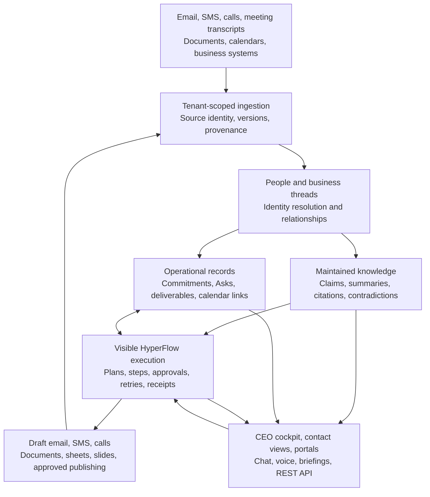
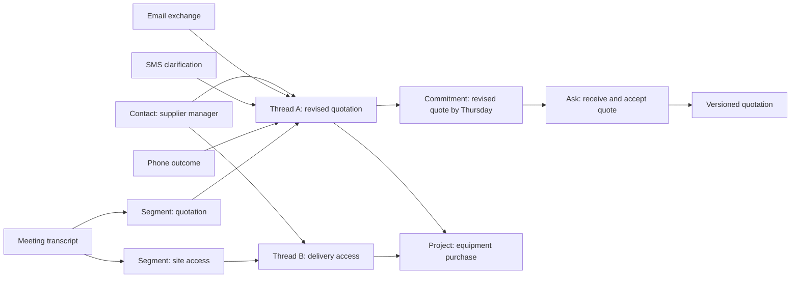

# HyperFlow: Turning Communication into Accountable, Repeatable Work

**Product and architecture paper for Codex**  
**First customer:** the CEO using HyperFlow to manage their own work and business relationships  
**Prepared:** 8 September 2026  
**Status:** proposed product model, grounded in the inspected HyperFlow repository; not a declaration of deployed capability

## Executive proposition

HyperFlow is a management operating system that turns incoming communication into understood context, explicit commitments, and visible work. Its first customer is a CEO managing too many conversations, obligations and deliverables across too many systems.

The user should be able to say, “Prepare my weekly report, chase the missing information, and show me what needs my decision.” HyperFlow should assemble a readable flow showing the sources, people, deadlines, actions, approvals and outputs involved. Routine work can proceed within delegated authority; uncertainty and exceptions arrive as specific Asks. The CEO can inspect, change, pause and reuse the flow.

The product promise is:

> Communicate naturally. See the work. Know what was promised, who owns it, when it is due, and what proves it is finished.

This model combines an operational knowledge layer with HyperFlow's existing execution and Human Ask foundations. Its central organising concept is a **business thread**: a continuing matter that retains its identity as it moves between email, SMS, calls, meetings, documents and calendar events.

For the first customer, email is strictly draft-only. SMS and phone are permitted execution channels, subject to configured recipient, purpose and delegation boundaries. This paper does not initiate any communications. Calendar changes, public publishing and new commercial commitments need explicit policies before automatic execution is enabled.

## 1. The management problem

A manager's work rarely arrives as a clean task with an owner, deadline and acceptance criteria. It arrives as “Can you send that through?”, a promise at the end of a meeting, a revised deadline in an SMS, a voicemail about a customer, or a spreadsheet attachment that contradicts last week's report.

The manager becomes the integration layer. They remember which person belongs to which matter, locate earlier decisions, translate conversations into tasks, chase missing inputs, and reconstruct the evidence needed to report progress. More communication creates more coordination work, even when the underlying business work has not increased.

| Pain point | What HyperFlow should make possible | Observable outcome |
|---|---|---|
| “I cannot remember what I promised.” | A source-linked view of obligations owed by me, with deliverable and due date. | Fewer commitments discovered only after they become overdue. |
| “I spend my day chasing people.” | Follow-up flows that contact the correct person, preserve the thread and escalate only exceptions. | Fewer manual follow-ups per completed obligation. |
| “The answer is somewhere in five systems.” | One permission-aware thread linking the original evidence and current understanding. | Less time reconstructing context. |
| “Meetings generate notes, but nothing happens.” | Extract candidate commitments and turn accepted ones into visible work. | More agreed actions acquire owners, dates and completion evidence. |
| “I do not know what I must produce this week.” | A deliverables view combining commitments, dependencies and available calendar time. | Earlier visibility of impossible schedules and missing inputs. |
| “Weekly reporting consumes Friday.” | A repeatable report flow over verified operational records and approved narrative context. | Shorter preparation time with traceable assertions. |
| “Automation is difficult to trust.” | Inspectable steps, explicit authority, recorded inputs and reviewable outputs. | The manager can explain and correct what happened. |
| “Every repeated request starts from scratch.” | Promote a successful run into a versioned template. | Similar work reuses an established process. |

The initial product should optimise the CEO's daily and weekly operating rhythm. Wider adoption by middle and senior managers follows the same pattern: their own obligations, their team's work, and the promises made by external parties.

## 2. Starting point and evidence boundary

The inspected local source and documentation describe the following foundation. Presence in source is not evidence of production acceptance. The Thread Register and related integration work were uncommitted when this paper was prepared.

| Area | Existing foundation | Extension required for this model |
|---|---|---|
| Work execution | Projects, tasks, actions, decisions, loops, run state and review gates. | A conversational flow compiler, reusable run promotion, richer deliverable planning and complete public API coverage. |
| Communications | Communications Service boundary for email, SMS, voice, people, history and signed callbacks. | Broader connector coverage, receptionist operating policies and end-to-end acceptance of the complete journeys. |
| Threading | Canonical thread references, routing logic, a local Thread Register and correction interface. | Meeting/document/calendar membership, richer matter relationships and permission-aware knowledge projections. |
| Email triage | Project/mailbox-scoped reconciliation, classification, provider-native draft preparation and digests. | Commitment extraction linked to a durable ledger; unified ingestion across more source classes. |
| Human Asks | Questions, approvals, revision, response interpretation and workflow gating. | A general commitment lifecycle with acceptance, changed terms, evidence review and obligation reporting. |
| Knowledge | Project data, bounded context reads and communication history. | Maintained entity/topic knowledge with claim-level provenance, contradiction handling and rebuildability. |
| Cadence | Schedules, leases, occurrence idempotency and retry/recovery patterns. | Manager routines spanning diary, reporting, follow-ups and content production. |
| Artifacts | Reports, action templates, selected Google Doc/Sheet integration and constrained external writes. | General document, slide, workbook, asset and publishing services with visual validation. |
| SaaS | Tenant membership and scoped resource access. | Complete tenant lifecycle, scoped API clients, quotas, billing/usage, retention controls and operational support tooling. |

Current reference documents disagree on some connector readiness, including Outlook. Codex must check the adapter and live acceptance evidence before presenting a connector as available. Existing code also includes a separate outbound email service route. For this customer's product policy, that route must not bypass draft-only email behavior: capability availability and customer authority are different concerns.

Relevant local foundations: [README](../README.md), [API reference](API.md), [Omnichannel specification](OMNICHANNEL_AGENT_SPEC.md), and [Integrated acceptance plan](OMNICHANNEL_ACCEPTANCE_TEST_PLAN.md).

## 3. Integrating the LLM Wiki idea

Karpathy's LLM Wiki proposes retaining raw sources, maintaining linked knowledge pages, and using explicit conventions to govern ingestion and maintenance. Its ingest, query and lint operations provide a useful pattern for accumulating understanding and checking stale or contradictory claims. [Source: Andrej Karpathy, LLM Wiki](https://gist.github.com/karpathy/442a6bf555914893e9891c11519de94f).

HyperFlow should adapt that pattern into a tenant-scoped knowledge service. The following architecture is our proposed extension: operational records remain authoritative for deadlines, permissions, approvals and execution. Knowledge pages explain and connect those records; they do not silently replace them. Retrieval still serves discovery and source inspection. Compiled understanding and live operational queries serve different purposes.

For example, a supplier page may explain the relationship, projects and recurring issues. The answer to “What does this supplier owe me today?” must query current commitment records. It can then use the page to explain context and link the original promise.

### Proposed product architecture



Tenant isolation, authorization, audit, provenance and usage accounting apply across every box. They are not a final filter added after a model has already read the data.

### Four forms of truth

1. **Source evidence:** what a message, transcript or document actually said, with provider identity, timestamps and retained versions.
2. **Derived understanding:** extracted facts and linked summaries, with confidence and supporting/contradicting evidence.
3. **Accepted operational state:** the current agreed owner, deadline, deliverable, approval and authority.
4. **Execution evidence:** what an action attempted, what the external system accepted, and what was verified afterwards.

An email saying “I sent the report” is evidence of a claim. A located report is evidence of delivery. Acceptance against the Ask's criteria establishes fulfillment. These should remain distinguishable in the UI and API.

## 4. Threads as the product's backbone

A business thread represents a matter with a continuing purpose: obtaining a supplier quote, resolving a customer issue, preparing a board pack, or arranging a meeting. Its identity survives channel changes.

Each thread should expose a concise current summary, participants and roles, linked projects, decisions, open commitments, next actions, source history and relevant artifacts. A user should be able to open it from any message, contact, calendar event, Ask or report reference.

### A network of related work



A meeting can contribute to multiple threads through referenced segments. A document can be relevant to several matters without being copied into each one. Use an explicit primary communication assignment where needed for compatibility with existing canonical thread records, plus typed secondary relationships. Do not force every new relationship into one mutable `thread_id` field.

### Resolution rules

Use trusted explicit correlation first, then provider reply relationships and permitted identity/project context. Semantic similarity can propose candidates. The same contact, similar subject, recent activity or phone number alone cannot establish that two obligations are the same.

If two active matters are plausible, ask a short clarification or hold the message for review. Show the reason for the proposed assignment in the Thread Register. A correction changes the appropriate association, records the actor and reason, and refreshes dependent projections. It must not silently replay completed work or rewrite the historical basis of an approval.

Thread status is separate from commitment status. Closing a conversation cannot mark its promises fulfilled. Resolving a triage item cannot approve a workflow. Reopening a thread need not reopen an accepted deliverable.

### Contact enrichment

Communications should remain authoritative for channel identities and canonical people. The proposed relationship layer links those people to organisations, roles, projects, meeting attendance and commitments. Imported contacts and optional enrichment providers add source-attributed suggestions rather than automatically overwriting verified identities.

For an upcoming meeting, HyperFlow can prepare: who is attending, their current role, the last relevant exchange, what we owe them, what they owe us, and unresolved decisions. Attendee identity can be matched using provider participant IDs, verified email addresses and calendar invitations. Ambiguous display names remain unresolved until confirmed.

External enrichment must be licensed/configured for the tenant, record provenance and verification time, and distinguish public business details from private internal notes. Being the same real-world person does not permit sharing tenant-private relationship history across customers.

## 5. From promises to accountable work

The commitment ledger is the bridge between communication and execution. It answers both directions: **what I owe** and **what I am owed**. An internal task may implement a commitment, but the two are not identical. One commitment may need multiple tasks; one deliverable may satisfy multiple explicitly linked obligations.

### Proposed commitment record

| Field group | Required meaning |
|---|---|
| Identity | Tenant, commitment ID, related thread(s), project and source references. |
| Parties | Obligor, beneficiary/requester, accountable internal owner and authorized acceptor. |
| Work | Deliverable, scope, acceptance criteria and supporting context. |
| Time | Original wording, interpreted due time/timezone, confirmation status and agreed revisions. |
| State | Candidate, awaiting acceptance, accepted, in progress, submitted, fulfilled, disputed, cancelled or declined. |
| Control | Dependencies, linked Asks and runs, follow-up policy, authority and escalation recipient. |
| Evidence | Who said/agreed what, submission references, verification and acceptance history. |

Overdue and at-risk are computed conditions over current state and time, rather than replacements for the lifecycle. Preserve original and revised deadlines so reporting can distinguish timely fulfillment from successful renegotiation.

```mermaid
stateDiagram-v2
    [*] --> Candidate: Promise detected
    Candidate --> AwaitingAcceptance: Owner and terms proposed
    Candidate --> Dismissed: Not a commitment
    AwaitingAcceptance --> Accepted: Authorized acceptance
    AwaitingAcceptance --> Declined
    Accepted --> InProgress
    InProgress --> Submitted: Evidence provided
    Submitted --> Fulfilled: Acceptance criteria verified
    Submitted --> InProgress: Revision required
    Accepted --> Renegotiation: Changed scope or deadline
    InProgress --> Renegotiation
    Renegotiation --> Accepted: Revised terms accepted
    Renegotiation --> InProgress: Change declined; prior terms remain
    Accepted --> Cancelled: Authorized cancellation
    InProgress --> Cancelled
    Fulfilled --> [*]
```



The diagram is the common path; disputed state and richer transitions should be specified in the domain contract. Renegotiation retains the previously accepted terms until the change is approved. Do not silently shift an overdue promise into the future because a later message mentions a new date.

### The Ask system's role

Use an Ask when work needs a person's answer, acceptance, information, decision or review. A commitment can generate an acceptance Ask, a missing-information Ask, and a later delivery-review Ask. These should be linked while remaining individually addressable.

For example: a supplier says in a meeting, “I'll send the revised quote Thursday.” HyperFlow extracts a candidate with the exact source segment. If the speaker and wording establish an explicit commitment under configured policy, record that source as acceptance; otherwise seek confirmation. A follow-up on Thursday uses the same matter thread. “Working on it” is progress, not delivery. “Can I send it Friday?” proposes a change. An attached quote creates a submission. Acceptance of the required version fulfills the commitment.

The CEO's own promises use the same model. “I'll send you the pack tomorrow” creates a deliverable obligation assigned to the CEO or delegated preparer. HyperFlow may prepare the pack and an email draft. It must keep the communication obligation open until sending/delivery evidence is actually available. A draft is not a kept promise.

Scoring should be transparent and contextual. Show due, submitted, fulfilled, renegotiated and disputed counts with source evidence. Avoid a hidden personal reliability score inferred from incomplete communications.

## 6. The knowledge service

Proposed knowledge objects include people, organisations, projects, matters, meetings, decisions, policies, processes and topics. Each page is a navigable projection over supported claims and operational links.

The ingestion flow preserves the source, normalizes metadata, resolves permitted identities, proposes thread links, extracts candidate facts/commitments, reconciles existing knowledge, and produces reviewable changes. A new source should not cause unrelated pages to be rewritten without a recorded dependency.

Handle several practical cases explicitly:

- **Repeated imports:** stable provider IDs and version/content fingerprints prevent a transcript imported from a meeting tool and a drive folder from doubling the meeting and its commitments.
- **Corrections:** retain source versions and regenerate affected claims. Accepted commitments require an explicit amendment; a summary correction alone cannot change contractual-looking terms.
- **Contradictions:** preserve competing claims, sources and dates. Prefer authoritative records for live operational values and surface unresolved conflicts.
- **Revoked access or deletion:** stop using the source immediately, invalidate affected summaries/caches, and rebuild authorized projections. Raw preservation is subject to tenant retention and deletion rules; it is not a promise to retain everything forever.
- **Mixed visibility:** do not produce a broadly visible summary from private inputs and merely hide its citations. Separate projections or enforce access to all supporting material.
- **Source instructions:** treat email, transcripts and documents as data. They cannot expand permissions, change delegation or authorize actions.
- **Generated outputs:** mark derivative provenance so a generated report re-ingested later does not count as independent corroboration.

Maintenance flows check freshness, unsupported claims, missing relationships, unresolved identities and contradictions. Knowledge can be rebuilt from permitted source evidence and authoritative records. A convenient Markdown export may support portability, but Markdown files alone should not become the transactional store for multi-user workflow state.

## 7. Natural-language ease, visible HyperFlow execution

The proposed flow compiler converts an intention into a constrained plan: named steps, inputs, outputs, dependencies, authority checks, Asks, failure handling and completion criteria. It draws from an approved action catalog and versioned templates.

For “Get the three supplier updates and prepare my Friday report,” the user should see steps such as identify missing updates, contact suppliers by permitted channels, wait for responses, reconcile commitments, prepare the report, validate figures and request review. Each step opens into its evidence and results.

The UI should expose useful explanations: “Waiting for Sam's delivery date,” “Report prepared using these six sources,” or “Calendar booking blocked by a conflict.” It need not expose private model reasoning. Display decisions, evidence and policy outcomes that a human can verify.

Every execution pins its flow/template version. Changing the template affects future runs unless an explicit migration is approved. Repeated successful ad hoc work can be promoted into a reusable flow after the user reviews its variables, permissions and exception paths.

The compiler itself must be testable: invalid tools, missing inputs, unauthorized actions and impossible dependencies are rejected before execution. AI generation is a proposal; the validated flow is the executable contract.

## 8. First-customer authority model

| Capability | Initial CEO policy | Product behavior |
|---|---|---|
| Email ingestion and drafting | Enabled for connected, selected mailboxes. | Prepare provider-native drafts; retain reply context; never send email through any alternate route. |
| SMS | Permitted within configured delegation. | Send routine communications to intended contacts with purpose, limits and delivery receipts. |
| Phone | Permitted within configured delegation. | Receive calls and place calls for allowed purposes; preserve context and meaningful outcome evidence. |
| Read and summarize | Permitted over granted resources. | Apply source permissions before retrieval and generation. |
| Prepare artifacts | Permitted. | Produce reviewable versions using approved templates and assets. |
| Calendar mutation | Proposed, not yet specified by the CEO. | Default to proposed changes until booking authority is configured. |
| Social/site publication | Proposed, not yet specified. | Prepare previews and request publication approval until a bounded recurring policy is enabled. |
| New commercial promises or spending | Not implied by channel permission. | Raise an Ask or require a specific delegation rule. |

Avoid repeated confirmation for routine actions already covered by an active policy. A policy should specify principal, tenant, recipients or contact classes, action, scope, schedule/contact windows, budget and expiry. Unknown recipients, material scope changes or exceeding a limit become exceptions.

An inbound caller's identity is not proven solely by displayed caller ID. Apply verification appropriate to the information/action requested. A receptionist may answer public business questions without the access required to disclose the CEO's diary or approve a purchase.

## 9. Deployment use cases

These scenarios define the complete product direction. Each is a visible flow using shared threads, knowledge, commitment records and permissions. Some require proposed connectors or action types; they are not all available today.

### 9.1 The CEO's morning operating brief

**Pain:** the CEO starts the day scanning several systems to discover what matters.

**Trigger and context:** a weekday schedule or “What do I need to deal with today?” reads permitted communications, commitments, current runs and calendar availability.

**Flow:** reconcile new sources → identify my deliverables and commitments owed to me → check dependencies and diary → rank exceptions by deadline and consequence → prepare the brief. Present actions as “decide,” “produce,” “follow up” or “delegate,” with links to the actual thread.

**Human decisions:** resolve ambiguous priorities, accept proposed delegations, and decide matters that exceed authority. Routine approved SMS follow-ups can proceed; email follow-ups become drafts.

**Output and exception:** a dashboard and optional SMS summary or scheduled phone briefing. Missing/stale connector data is labelled with its last successful sync, rather than presenting a complete-looking brief.

**Measure:** time from opening the brief to understanding the day's obligations; number of late-discovered deliverables. Prefer one focused brief and exceptional alerts over constant notifications.

### 9.2 Receptionist for calls, SMS and email

**Pain:** interruptions consume executive attention and requests are lost between channels.

**Trigger and context:** an inbound call, SMS or email arrives at a tenant identity. Use verified routing, business hours, public company information, permitted contact context and receptionist policy.

**Flow:** identify intent → find or open the business thread → answer permitted questions → collect missing details → create an Ask or route to an accountable owner → arrange a callback or propose a booking. Urgency rules should be configured by the CEO rather than guessed from tone alone.

**Human decisions:** unexpected commitments, confidential disclosures and exceptions go to the CEO or nominated delegate. Human transfer is a proposed capability requiring telephony support; when unavailable, offer a callback without claiming a transfer succeeded.

**Output and exception:** a structured request, callback obligation and complete thread. Phone/SMS can acknowledge within policy. Email receives triage and a draft, so the initial product does not promise instant emailed acknowledgements. Unknown identity or unavailable context produces a bounded intake path.

**Measure:** interruption reduction, request capture completeness, callback completion and time to the correct owner.

### 9.3 Supplier follow-up across channels

**Pain:** the CEO repeatedly asks for updates and re-explains the matter on each channel.

**Trigger and context:** a supplier commitment approaches its deadline; the thread contains the original request, accepted scope and prior replies.

**Flow:** check for already-received evidence → send an allowed SMS → wait for a meaningful response → call if the agreed escalation rule is met → interpret progress, submission or revised terms → update the appropriate Ask. Prepare an email draft when a written follow-up is useful.

**Human decisions:** accept a material deadline/scope change. The same contact's other matters do not enter the conversation unless relevant and authorized.

**Output and exception:** current commitment status with a contact history. “Delivered SMS” and “call finished” remain transport/action outcomes; “quote received and accepted” is the business outcome. Contact limits prevent repeated chasing across channels during a provider delay.

**Measure:** manual chases avoided, time to accepted delivery and incorrect/duplicate follow-ups.

### 9.4 Meeting ingestion and follow-through

**Pain:** meeting notes contain useful promises and decisions but create another document to reread.

**Trigger and context:** already-transcribed notes arrive through a meeting-platform webhook, drive folder, upload, email attachment or REST API. Store the meeting's provider ID, time, participants, transcript version and speaker evidence. No new transcription engine is assumed.

**Flow:** deduplicate source versions → resolve attendees → segment by matter → enrich each segment with permitted contact/project history → extract decisions and candidate commitments → flag conflicts → create or update linked Asks → draft the follow-up pack.

**Human decisions:** confirm ambiguous speakers, conditional promises and unassigned actions. An invitation list can support identity matching but cannot prove who actually made a statement.

**Output and exception:** an enriched meeting view, links to affected threads, decisions and obligations with source segments, plus a follow-up email draft. Partial or low-quality transcripts visibly limit confidence; invented due dates are prohibited.

**Measure:** time from transcript arrival to reviewed actions; percentage of accepted actions with owner, due date and source.

### 9.5 Diary, scheduling and meeting preparation

**Pain:** the calendar records meetings but does not show the preparation or delivery work needed around them.

**Trigger and context:** a booking request, a new deadline, a changed meeting or a request to plan the week. Use connected calendars, work hours, timezones, travel/buffer preferences, obligations and estimated effort.

**Flow:** find authorized availability → propose slots → obtain agreement → recheck availability → create/update the provider event if delegated → link preparation and follow-up work → produce a pre-meeting brief. Calendar providers remain authoritative for event state; HyperFlow owns the work linked to it.

**Human decisions:** initially approve calendar mutations and priority tradeoffs. Later allow tightly defined bookings automatically. Proposed focus blocks must not masquerade as confirmed meetings.

**Output and exception:** provider event references, preparation checklist and conflict warnings. Handle concurrent booking, changed recurrence, cancellations, daylight-saving transitions and provider sync delays. Calendar invitations can generate email; that side effect needs explicit authorization under the draft-only policy before enabling invite creation.

**Measure:** scheduling exchanges, double bookings, preparation completeness and overload detected before a deadline.

### 9.6 Weekly management report

**Pain:** the CEO spends hours collecting updates and reconciling inconsistent progress claims.

**Trigger and context:** a weekly schedule uses a reporting cutoff, approved template, project state, commitment ledger, financial/operational sources where connected, and current knowledge summaries.

**Flow:** freeze the reporting period → identify missing inputs → chase under policy → distinguish verified results from reported claims → calculate metrics from structured data → generate commentary → validate figures and citations → present for review.

**Human decisions:** approve material interpretations and the final report. If critical information is missing, choose to wait or publish a visibly incomplete version.

**Output and exception:** a versioned document, optionally a deck and workbook, with source references and an email draft. Subsequent corrections create a new version; the original report remains reproducible from its recorded inputs.

**Measure:** preparation time, correction rate and percentage of material assertions with evidence. Avoid copying current counts into knowledge pages and treating those copies as live truth.

### 9.7 Branded presentations and documents

**Pain:** assembling the same board, client and internal packs repeatedly requires copying content and fixing formatting.

**Trigger and context:** “Prepare the board pack using the approved template” selects a template version, brand kit, content schema, permitted facts, asset rights and output format.

**Flow:** map required sections → gather missing inputs with Asks → assemble the narrative → populate template → render → check visual layout, branding and data consistency → review → export a versioned artifact.

**Human decisions:** approve sensitive wording and the final version. A reusable template includes required sections, logo/font/color rules, example layouts and validation criteria, not merely an old file to copy blindly.

**Output and exception:** editable slides/documents and a review preview. Missing brand assets, unavailable fonts, overflow, broken charts or unsupported export features block completion or create explicit exceptions.

**Measure:** time to an approved pack and manual formatting corrections. Retain citations in appropriate notes or an appendix when the public-facing layout must remain clean.

### 9.8 Excel and Google Sheets work

**Pain:** spreadsheets become disconnected reporting silos and repetitive updates are error-prone.

**Trigger and context:** a recurring tracker update, requested analysis or accepted deliverable uses an approved workbook/sheet, schema, named ranges and source data.

**Flow:** read permitted ranges → validate types/units → propose or calculate changes → write only authorized cells/rows → verify formulas and totals → save a receipt and artifact version. Local Excel-file generation and live connected-workbook editing are different adapters and should be labelled separately.

**Human decisions:** approve destructive changes, structural changes and overwriting manually maintained areas unless explicitly delegated.

**Output and exception:** a validated workbook or confirmed Sheet update linked to its flow. Duplicate callbacks reuse the same write receipt; conflicting human edits trigger reconciliation instead of blind overwriting.

**Measure:** rekeying avoided, reconciliation errors and duplicated rows. Model-generated arithmetic is not the calculation engine; use deterministic formulas/computation and verify outputs.

### 9.9 Social content and publication

**Pain:** turning approved business material into consistent posts interrupts higher-value work.

**Trigger and context:** an approved report, event or content schedule references brand tone, platform constraints, licensed assets and a publication policy.

**Flow:** select publishable facts → remove internal-only material → create channel-specific drafts → preview → raise a publication Ask → schedule/publish through a configured adapter after approval → verify external post ID and resulting state.

**Human decisions:** initial publication approval is required. Recurring publication may later be delegated for a bounded content class. Channel permission for SMS/phone does not authorize social posting.

**Output and exception:** reviewed posts and provider receipts, linked to the source campaign thread. A timeout after provider acceptance is reconciled before retry; it must not create duplicate posts. Deleted or failed posts remain visible as such.

**Measure:** time to approved content, publication accuracy and review effort. Engagement can be reported when connected, but is not assumed to prove business impact.

### 9.10 Website maintenance

**Pain:** small page updates become forgotten commitments or untracked edits.

**Trigger and context:** “Update the services page with the approved wording” uses an allowlisted CMS/page, current revision, content model, assets and publication rules.

**Flow:** fetch current version → generate a scoped change → show preview/diff → validate links, layout and accessibility basics → obtain approval → publish → fetch the live page and verify the intended change.

**Human decisions:** approve publication initially and resolve conflicts with intervening human edits. Rich redesign and arbitrary code deployment are separate scopes from routine content maintenance.

**Output and exception:** a published revision with verification evidence and a supported rollback path. A successful API submission alone does not close the website-update commitment; deployment/cache failures remain open.

**Measure:** request-to-verified-change time, unintended edits and rollback frequency.

### 9.11 Relationship and commitment briefing on demand

**Pain:** the CEO enters a conversation without remembering outstanding obligations or the latest change.

**Trigger and context:** “What do I owe Alex, what does Alex owe me, and what should I raise?” from the UI, SMS, phone or API.

**Flow:** verify requester → resolve the correct contact → query current commitments and relevant threads → add permitted relationship context → provide a concise answer with routes to supporting evidence.

**Human decisions:** resolve ambiguous identities or disputed status. An external Alex asking the same question receives only records shared with Alex, not the CEO's private assessment or other contacts' obligations.

**Output and exception:** contact overview, spoken summary, SMS response or structured API response. Email inquiries can produce a draft response for the CEO. Sensitive detail is minimized on channels with weaker verification.

**Measure:** context lookup time and unsupported/outdated answers. “No accessible records found” must be distinguished from “nothing is owed.”

### 9.12 Busy work becomes a reusable operating flow

**Pain:** repetitive work is performed from memory and depends on the same person every time.

**Trigger and context:** after a successful weekly pack, onboarding sequence or supplier chase, the CEO asks to repeat it automatically.

**Flow:** identify stable steps and variable inputs → name the flow → review authority and exception rules → version the template → choose cadence → run future instances with visible evidence and improvement feedback.

**Human decisions:** approve the reusable contract once; review material changes separately. A new run gets current facts and does not blindly copy prior decisions or recipients.

**Output and exception:** a replicable process that can be delegated, inspected and improved. If a provider/template changes, validation catches the mismatch before an external action.

**Measure:** setup effort amortized over repeat runs, exception rate and successful reuse without manual reconstruction.

## 10. One complete example: meeting to kept promise

Consider a supplier review meeting. The supplier promises a revised quote by Thursday; the CEO promises a recommendation for Friday's management meeting.

```mermaid
sequenceDiagram
    participant Source as Transcript source
    participant HF as HyperFlow
    participant CEO as CEO
    participant Supplier as Supplier
    participant Artifacts as Artifact service
    Source->>HF: Transcript and participant metadata
    HF->>HF: Resolve contacts, thread segments and candidate promises
    HF->>CEO: Ask about ambiguous terms only
    CEO->>HF: Confirm owner and acceptance criteria
    HF->>HF: Create linked supplier and CEO commitments
    HF->>Supplier: Authorized SMS follow-up on the same matter
    Supplier->>HF: Reply with a proposed delay
    HF->>CEO: Ask whether revised deadline is acceptable
    CEO->>HF: Accept revised terms
    Supplier->>HF: Quote received through email ingestion
    HF->>HF: Link artifact and verify required information
    HF->>Artifacts: Prepare recommendation using approved template
    Artifacts->>HF: Versioned document and preview
    HF->>CEO: Review Ask with source evidence
    CEO->>HF: Accept recommendation
    HF->>HF: Prepare email draft; delivery obligation remains open
    CEO->>HF: Confirm manual sending, or connector observes sent evidence
    HF->>HF: Update delivery and fulfillment according to criteria
```

At any point the CEO can ask by phone, SMS, UI or API what is holding the recommendation up. HyperFlow should answer from live dependency state: “The quote is now due Friday at 09:00 under the change you accepted; your recommendation depends on it.” That answer is more useful than another summary of the meeting.

Observing sent-mail evidence is a proposed connector requirement; until available, use an explicit human confirmation with provenance. Do not mark it as provider-verified delivery.

## 11. Access for the CEO, staff and contacts

The product needs several views over the same authorized records, rather than separate assistants with competing memories.

| Access path | CEO/internal use | External-contact use |
|---|---|---|
| Today cockpit | Decisions, my deliverables, commitments owed to me, risks and active flows. | Not exposed as a whole. |
| Contact workspace | All permitted matters, correspondence, upcoming meetings and obligations for that contact. | Shared relationship view limited to explicitly shared matters. |
| Thread workspace | Current understanding, evidence timeline, open Asks and execution. | Selected thread participation, submission and status access. |
| Commitment register | Filter by owing/owed, owner, contact, project, due date, risk and state. | Own or explicitly shared commitments only. |
| Search and conversational UI | Source-backed questions, plan requests and flow control. | Scoped requests through a verified portal or permitted channel. |
| SMS and voice | Briefings, questions, routine execution requests and permitted Ask responses. | Intake, clarification, updates and supported verified responses. |
| Email | Ingestion and prepared drafts for the CEO. | Inbound submissions/replies; no automatic outbound email in the initial policy. |
| Ask link or portal | Review, revise, accept and submit evidence. | Scoped, expiring access; stronger identity verification for sensitive decisions. |
| REST API and webhooks | All authorized reads/actions, integrations and event subscriptions. | Explicitly scoped clients; never unrestricted contact-based access. |
| Export and briefing | Portable documents, reports and authorized evidence bundles. | Deliberately shared outputs with recorded audience. |

The default CEO interface should answer three questions immediately: **What do I need to decide? What do I need to produce? What am I waiting on?** A fourth view shows the flows currently doing work. Preserve a route from every summary back to its evidence and from every exception to the action that can resolve it.

## 12. REST API parity as a product contract

Every product operation must be possible through authenticated REST resources, including initiating external connection authorization and checking its status. Providers may still require a human OAuth consent or verification step; API parity cannot bypass that. The UI, conversational interface and scheduled services should use the same domain commands and permission rules.

The following `/v1` surface is **proposed**, not a description of routes already implemented. It is a public product facade. Existing HyperFlow `/api` routes and Communications `/v1` routes can remain behind it during migration. Do not expose backend service credentials to browser or customer API clients.

| Proposed resource family | Representative operations |
|---|---|
| `/v1/tenants`, `/members`, `/roles`, `/api-clients` | Tenant administration, membership, delegated service identities and credential rotation. |
| `/v1/connections`, `/source-imports`, `/sources` | Start consent, inspect health, ingest/fetch versions, replay scoped sync and apply retention. |
| `/v1/contacts`, `/organizations`, `/identities` | Search, resolve, propose merges, approve corrections and inspect provenance. |
| `/v1/meetings`, `/meetings/{id}/segments` | Import transcripts, link participants and associate segments with matters. |
| `/v1/threads`, `/threads/{id}/links`, `/thread-corrections` | Read/search/update matters, attach typed evidence and audit corrections. |
| `/v1/knowledge`, `/claims`, `/knowledge-jobs` | Read authorized knowledge, inspect evidence, propose changes and run maintenance. |
| `/v1/commitments`, `/commitments/{id}/transitions` | Create candidates, accept terms, renegotiate, submit, dispute and fulfill with evidence. |
| `/v1/asks`, `/asks/{id}/responses` | Raise, deliver, answer, revise and resolve under the exact Ask contract. |
| `/v1/flow-templates`, `/flows`, `/runs` | Compile a proposed flow, validate, version, execute, pause, cancel and inspect steps. |
| `/v1/deliverables`, `/artifacts`, `/templates`, `/brand-kits`, `/assets` | Produce, render, review, version, export and trace outputs. |
| `/v1/email-drafts`, `/sms`, `/calls` | Prepare drafts; dispatch permitted messages/calls; inspect provider receipts and results. |
| `/v1/calendars`, `/calendar-proposals`, `/bookings` | Query availability, review changes, book and reconcile provider versions. |
| `/v1/publications`, `/website-changes` | Preview, approve, publish, verify and perform supported rollback. |
| `/v1/briefings`, `/reports`, `/search` | Query authorized operational state and produce source-backed answers and outputs. |
| `/v1/schedules`, `/operations`, `/events`, `/subscriptions`, `/usage` | Cadence, async status, event delivery, audit and cost/limit visibility. |

### Contract requirements

- Publish an OpenAPI specification, typed schemas and examples. Generate clients and contract tests from the same source; version breaking changes.
- Authorize each resource and transition using the caller's tenant, role, grants and delegation. A caller-supplied tenant ID is a selector, not proof of membership.
- Use stable IDs and explicit relationships. Return paginated collections with deterministic ordering, filters, source freshness and state versions.
- Use `202 Accepted` with an operation reference for long-running generation, calls, imports and publishing. Expose progress, results, errors and cancellation limits. Cancelling an operation cannot unsend a message.
- Require idempotency keys for external actions and durable transitions. Reuse after uncertain outcomes must reconcile against the original operation; reuse with different input should fail.
- Use conditional updates/version checks for concurrent edits. A late reply must not overwrite a newer accepted commitment or satisfy an old Ask run.
- Treat event delivery as at least once. Sign and timestamp webhooks, support replay windows and durable retry/dead-letter handling, and supply event IDs and aggregate versions. Enforce effectively-once effects through receipts and state transitions.
- Define consistent error types, retryability and correlation IDs. Examples include unauthorized scope, ambiguous identity, stale version, policy denial and provider outage.
- Enforce email draft-only at the domain boundary across UI, API, agent, scheduled flow and service adapter. An alternate route must not become a policy escape.
- Do not require the UI to perform hidden direct database mutations unavailable to API clients. Existing direct writes should be inventoried and migrated deliberately.

## 13. Multi-tenant SaaS design

### Data ownership and authorization

Retain the current service boundary: Communications owns canonical channel interactions, provider identities and communication delivery; HyperFlow owns work intent, Asks, flow state and policy. Add knowledge, commitment and artifact services as explicit logical modules first. They need not become separately deployed microservices immediately.

Each source, link, claim, operation, embedding/search entry, artifact and audit event has tenant scope. Private CEO material has a narrower visibility class than shared tenant material. Connector consent does not automatically make all mailbox content visible to every tenant member.

Cross-tenant relationships require explicit sharing records or controlled exchanges, not implicit joins on a shared email address. A supplier may participate in several customers' tenants without obtaining access to their combined histories.

### Operational reliability

Use durable queues/jobs for ingestion and generation, transactional claims for work, stable action receipts and reconciliation jobs. A provider's successful acceptance may precede a local timeout; inspect provider/idempotency records before repeating the action. Split provider delivery state from application outcome and business fulfillment.

Maintain per-tenant limits, fair scheduling, concurrency controls and contact budgets so one large import or retry storm cannot starve other customers. Track connector freshness and operational health in the UI. Backups, restoration drills, retention/deletion and export should be product requirements with measurable objectives selected before commercial launch.

### Onboarding and operation

The first-run experience asks the CEO to select workspaces/mailboxes, connect controlled phone/SMS identities, establish their own contact identity, choose allowed projects, set timezone and designate initial templates. It then offers one concrete working routine, such as the morning commitment brief.

Run a readiness check for each enabled capability. Unsupported connectors or missing permissions appear as unavailable, not decorative configuration. A capability registry should describe read/write support, authentication, resource scope, side effects, costs, idempotency behavior and verification method.

### Commercial completeness

Provide tenant lifecycle, seat/role management, usage visibility, connector health, support access audit and a billing/entitlement boundary. Proposed packaging is a workspace subscription plus transparent metering for expensive operations such as call minutes and artifact generation. This is a product hypothesis, not a pricing recommendation or market claim.

Track model usage, provider calls/messages, storage, enrichment requests and generation/render costs per tenant and flow. Show forecast and actual consumption, enforce budgets and attribute failures. Reusable templates and incremental processing should reduce repeated work, but their economic benefit needs measurement.

## 14. Implementation roadmap for Codex

Codex should first inventory the current implementation and contracts, then produce bounded implementation increments with tests and visible acceptance evidence. This paper authorizes a design direction; it does not claim the following work has been implemented.

| Stage | Deliverable | Exit condition |
|---|---|---|
| 0. Establish the baseline | Verify current routes, tenant rules, providers, Thread Register changes and deployed flow behavior; enforce CEO email policy across all paths. | The existing email/SMS/voice journey passes with source/provider evidence; gaps are explicit. |
| 1. CEO operating core | Commitment ledger, source-linked candidates, Ask lifecycle links, my obligations/owed-to-me views and contact/thread access. | The CEO can identify what is due, from whom, and why without reconstructing inbox history. |
| 2. Meetings and knowledge | Multi-source transcript imports, deduplication, participant resolution, thread segments and maintained knowledge projections. | One meeting produces reviewed obligations and useful context without duplicate or cross-tenant records. |
| 3. Repeatable routines | Morning brief, supplier chase and weekly report as visible versioned flows; phone/SMS access and receptionist intake. | Routine work completes under delegation, with exceptions represented as Asks and no unintended email sends. |
| 4. Diary and production | Calendar adapters and booking policy; branded document/deck/workbook templates and validation. | A meeting-to-report workflow produces correct events and reviewable artifacts with receipts. |
| 5. Publishing and SaaS maturity | Social/CMS adapters, previews/verification, complete API parity, metering, onboarding, export and operational support. | Authorized publication is verified externally; a second tenant can onboard without data leakage or bespoke operator intervention. |

API contracts, authorization and evidence capture are part of every stage, not deferred to Stage 5. Stage 5 closes parity gaps and prepares broader operation.

The first valuable vertical slice is: **ingest a meeting transcript and relevant email → link the people and matter → show what I owe and am owed → follow up by SMS/phone → prepare the deliverable and email draft → verify the outcome through Asks.** This exercises the distinguishing capabilities before adding a broad collection of connectors.

### Suggested domain decisions before schema implementation

Specify commitment state transitions and evidence requirements; thread primary/secondary relationships; source version identity; knowledge visibility rules; stable contact ownership; API caller/delegation model; and template/run versioning. Resolve these in short architecture decisions and shared contract fixtures before adding UI-specific storage shapes.

Prefer extending proven primitives over duplicating them. Use existing Ask gating for decisions, existing Communications identity for channel correlation, existing run receipts for execution, and existing triage recovery patterns for incremental ingestion. Generalise carefully where current semantics are coaching-specific.

## 15. Validation and success measures

The existing integrated acceptance plan is the starting point, extended with meeting, knowledge, commitment and artifact tests. Measure the current manual baseline with the CEO first; proposed improvement targets should not be presented as achieved savings.

| Dimension | Measure and acceptance evidence |
|---|---|
| Management value | Weekly time spent reconstructing context, chasing and preparing recurring outputs; late-discovered obligations. |
| Commitment quality | Reviewed extraction precision/recall on a labelled sample; owner/date completeness; false fulfillment count. |
| Thread quality | Correct automatic associations, unnecessary splits, incorrect merges and correction persistence on controlled cases. |
| Knowledge quality | Source coverage, stale/contradictory claims, unsupported answers and access-revocation propagation. |
| Execution | Successful runs, exception rate, retry convergence, provider reconciliation and duplicate side effects. |
| Artifacts | Factual/formula correctness, template/brand compliance, visual defects and review time. |
| API parity | Each supported UI action has an equivalent authorized API contract and automated contract test. |
| Economics | Cost per completed flow/deliverable, contact minutes/messages and ingestion volume per tenant. |

Release-blocking failures include cross-tenant disclosure, an unauthorized send/publish, a false accepted/fulfilled commitment, a wrong-party action and duplicate billable dispatch caused by replay. Test ambiguous identity, conflicting deadlines, simultaneous responses, expired authority, connector outage and revoked source access deliberately.

A response that says “done” is never sufficient acceptance evidence for the product itself. Verify persisted state, provider effects and the human-readable UI together. Some business tasks legitimately use self-attestation; label that evidence type and apply it only where the acceptance criteria permit it.

## 16. Assumptions and unresolved decisions

| ID | Assumption or decision | Consequence |
|---|---|---|
| A01 | Codex is the paper's audience; the CEO is the first customer. | Prioritise implementable domain contracts and a coherent personal operating routine over investor positioning. |
| A02 | CEO email is draft-only across all product entry points. | No automated email send, including through the existing service-identity path. Sending evidence remains distinct from a draft. |
| A03 | SMS and phone are permitted channels for configured business purposes. | Build execution flows without asking repeatedly for already delegated routine actions; define recipients, limits and exceptions during setup. This paper itself sends nothing. |
| A04 | Permission to communicate is not permission to spend or make new material business commitments. | New obligations exceeding delegation require an Ask. |
| A05 | Meeting sources are already transcribed. | Build imports, normalization, segmentation and enrichment; transcription is outside the initial scope. |
| A06 | Provider accounts and grants must be connected and verified. | Exact provider support is a capability check. Initial examples are adapter-neutral; no unverified connector is promised. |
| A07 | Calendar mutation and public publishing authority are unspecified. | Default to proposals/previews and approval until a policy is configured; consider provider-generated email invitations explicitly. |
| A08 | Australia/Brisbane is the CEO's default timezone from workspace context. | Preserve source timezones and confirm ambiguous dates; other tenants choose their own timezone. |
| A09 | The CEO can have private information inside a business tenant. | Implement personal/project/shared visibility rather than universal tenant-member access. |
| A10 | External contacts receive only explicitly shared information. | Build scoped portals/Asks and channel verification, not a public version of the internal contact workspace. |
| A11 | Fulfillment needs criteria-appropriate evidence. | Configure whether self-attestation, receipt or human acceptance is sufficient for each commitment type. |
| A12 | Brand kits, reusable templates and publishing adapters are proposed product capabilities. | Start with selected formats and a small approved library; validate export fidelity before expanding. |
| A13 | REST parity is a target architecture requirement, not current completeness. | Inventory direct writes and private routes; add a stable facade without breaking existing consumers. |
| A14 | Enrichment and retention depend on tenant-approved sources and policy. | Preserve provenance, respect deletion/revocation and avoid unverified identity merges. Jurisdiction-specific requirements need separate review when deployment scope is chosen. |
| A15 | This is a logical architecture, not a decision to replace existing databases or deploy many services. | Validate needs before infrastructure changes; use clear module boundaries first. |

Remaining choices for implementation are the first calendar and transcript providers, first output formats/templates, contact/enrichment source, notification/contact windows, calendar booking limits, commercial packaging and operational recovery objectives. None changes the central model; each should become a recorded configuration or architecture decision rather than an invisible model assumption.

## 17. Product definition

HyperFlow converts the CEO's communication load into a managed system of context, commitments and execution. Threads keep a matter coherent. Knowledge makes its history useful. Asks establish what a person must decide or deliver. Flows turn recurring coordination into work that can be seen, repeated and improved.

The desired experience is simple: the CEO states an outcome in ordinary language, HyperFlow makes the work explicit, permitted actions proceed, and the CEO is brought back only where judgment or authority is needed. Every obligation and claimed result remains reachable through the UI, the relevant contact or thread, permitted communication channels, and the REST API.
