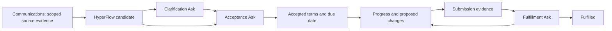

# Operational commitments: Phase 04

HyperFlow owns the accepted obligation. Communications Service owns people, communication threads, extracted promise evidence and its existing memory. No Communications schema, memory store or extracted-status writer changes in this phase.

## Contract and ownership

`operational_commitments/{orgKey}/{obligationId}` is server-only Firebase state. Its aggregate contains the organization/project, version, reviewer, owner, beneficiary, deliverable, acceptance criteria, due instant and timezone, source ID/version/canonical communication references, accepted evidence, proposed terms, submission, current Ask, prior Asks and decision history. History retains terms proposed and accepted, including rejected proposals. Raw source excerpts are not returned by the ledger API; the UI retrieves current evidence through the scoped Communications adapter.

`user:<uid>` is an authenticated organization member; `contact:<id>` identifies a canonical Communications contact in that tenant. Contact records are not copied into a new CRM. The creating member is the review custodian. That member can attest to an external agreement with a required evidence note; this is not proof that the external contact personally authenticated or clicked an approval. Other member owners/beneficiaries can propose terms, record progress or disputes, and request cancellation; submission is restricted to the owner or custodian. Only the custodian answers review Asks, dismisses candidates or configures follow-up. Reassigning the custodian and external-party signing are not implemented here.

Every mutation uses a Firebase transaction with `expectedVersion`. A response must match the currently open Ask ID and aggregate revision and its assigned reviewer. Two concurrent responses cannot both apply. Existing `HumanAsk`, `createAsk`, response validation and response recording are reused. These are aggregate review Asks, with no fabricated workflow run; answering them never advances a workflow. Existing workflow Asks retain their own current-run/authorized-review rules, covered by the regression suite.

Aggregate review Asks are available in Obligations and its REST API. They are not projected into the existing workflow Approvals inbox or sent through public token forms. A unified CEO inbox is later programme work.

## Lifecycle

| Action | Result and guard |
|---|---|
| Create/import | Always `candidate`; never infer business acceptance from source `open` or `completed`. Missing/invalid terms produce a clarification Ask. |
| Clarify | Complete terms plus evidence answer a question Ask; a separate acceptance Ask follows. |
| Accept | Current approval Ask, complete terms and an evidence note produce `accepted`. Dirty submitted terms are rejected. |
| Progress | Accepted obligation becomes `in_progress`; current review must be resolved first. |
| Propose changed terms | Previous accepted terms remain in force. Approval replaces them; rejection/revision discards the proposal while history preserves it. |
| Submit | Evidence creates `submitted` and a fulfillment Ask. A draft or callback alone cannot fulfill anything. |
| Review submission | Explicit approval produces `fulfilled`; revision/rejection returns to `in_progress`. |
| Dispute | `disputed`, preserving accepted terms and cancelling any outstanding review/proposal. |
| Request cancellation | Creates a cancellation Ask. Approval produces `cancelled`; the request itself does not close the obligation. |
| Dismiss | Candidate only, with custodian identity and reason; produces `dismissed`. |

Fulfilled, cancelled and dismissed records are closed to subsequent lifecycle edits. `overdue` and `atRisk` are derived from the current accepted due instant, dispute/proposal state and lead time; they do not overwrite lifecycle state. The UI displays the recorded timezone. The due instant must have an explicit offset and a real calendar date; timezone must be recognized. The reviewer remains responsible for agreeing that the chosen instant matches the intended local deadline.

## Source scope and freshness

Use `memory-context.v1` only. Project discovery is bounded to the existing search adapter's open extracted promises. An optional scoped thread reference allows historical promise evidence, including legacy completed rows. An empty result is not an exhaustive historical search. Candidate ID is stable per project and source ID; importing the same source/version is idempotent.

Candidates without accepted evidence are hidden from ledger reads when their current source/version cannot be recovered. Acceptance revalidates the source; stale, revoked or changed evidence requires refresh. Refresh replaces the candidate Ask and revision. Once accepted, terms and the human decision history are an independent HyperFlow operational record; later source changes never silently rewrite them. An explicit source refresh records a change warning once per observed source version. Source refresh is not a background subscription. Current raw evidence remains subject to Communications scope and freshness checks.

HyperFlow uses its existing organization membership/project model and excludes private evidence. There is no new per-project ACL or per-mailbox grant model. Cross-service source validation and Firebase acceptance are not a distributed transaction: a source can change immediately after validation. The accepted citation records the version reviewed; later refresh flags divergence.

## Follow-up and delivery limits

Follow-up stores a web-review flag and a lead time of 0–720 hours. No scheduler, SMS, call or email dispatch is added. The existing email authority remains untouched. This phase does not connect obligations to newly generated flows, external acceptance links, meeting ingestion, notifications or artifact production; those remain later programme phases.

Source imports are idempotent; manual creation returns a new ID on each POST. On an uncertain manual POST, inspect the ledger before repeating it. List pagination is by stable ID, 50 records per underlying page; filtering may leave an empty page with a next cursor. Existing contact selection is limited by the Communications people endpoint's returned directory.

## Rollout and recovery

Deploy the reviewed HyperFlow branch after merge. No Communications release or migration is required: this consumes the already deployed memory contract. Firebase's default-deny root rules protect the new server-only collection. The Vercel rewrite shares the existing status function, preserving the function-count limit.

Production acceptance must use a real organization member: open Obligations, persist a controlled candidate, reload, approve, propose/reject a change, submit/revise/fulfill, and inspect source scope and history. Verify stale/concurrent replies and denied tenant access without provider sends. Local browser fixtures and emulators do not prove deployed authentication or persistence. Roll back HyperFlow code if needed; retain the operational records and their audit history. Do not delete or rewrite Communications evidence.
